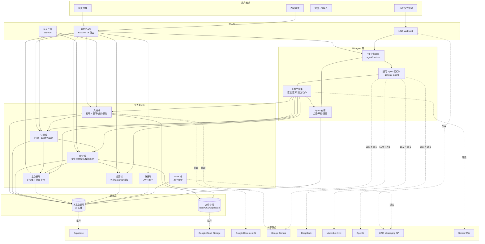

# 系统能力图 · 结构化清单（供绘图使用）

> 全部内容基于 `v3_backend/` 代码事实，路径可验证。
> 编排原则：从用户触点 → 接入层 → 业务能力 → AI/Agent 层 → 数据层 → 外部服务。
> 横切关注点单独列出。
> 文末附 Mermaid 骨架，GPT 可直接改造。

---

## 0. 全局原则（贯穿所有层）

- **域边界机器强制**：`domains/**` 禁止 `from agent.*`；`agent/**` 不直接 `db.commit / db.add`
- **跨域调用只通过对方的 `service.py`**；其他模块互不可见
- **数据库共享，schema 用 expand/contract 演进**（与 v2 共用 Supabase）
- **后台任务进程内 asyncio**（接口预留 Celery）

---

## 1. 用户触点层（Touchpoints）

| 节点 | 代码位置 | 作用 |
|---|---|---|
| 网页前端 | （v2-frontend，外部仓库） | 主要用户界面 |
| LINE 官方账号 | `apps/line/webhook.py` | 客户聊天 / 推送 / 业务交互 |
| 微信 | 字段已就绪（`ChatSession.platform_type`） | 未接入 |
| 内部接口 | `apps/http/internal.py` | 系统级触发（如汇率刷新） |

---

## 2. 接入层（Entry Points）

| 节点 | 代码位置 | 作用 |
|---|---|---|
| HTTP API（FastAPI） | `apps/http/` (18 个路由文件) | 对外业务 API |
| LINE 适配器 | `apps/line/` (handlers / delivery / flex_renderer / identity / session / agent_runner) | LINE 消息进出 + 适配到 Agent |
| 后台任务运行时 | `apps/jobs/runner.py` | 长任务 / 异步任务调度（进程内） |

**HTTP 路由清单**（18 个）：
auth · users · documents · orders · order_financials · inquiry · masterdata · settings · settings_phase6_stubs · data_upload · excel · chat · artifacts · line_bind · files · internal · _chat_streams · _inquiry_streams · _deps

---

## 3. 业务能力层（Business Domains）

共 **7 个 domain**。每个 domain 暴露一个 `service.py`，内部模块对外不可见。

### 3.1 文档域 `domains/document/`

| 能力 | 代码 |
|---|---|
| 文档 CRUD | `service.py` + `repository.py` |
| 上传 + 抽取（多引擎） | `extraction/` 子目录 |
| 文档分类 | `classifier.py` |
| 投影分发 | `projector_registry.py`（按 doc_type 路由到对应业务域） |
| 工作流编排 | `workflow.py` |
| 自动摘要 / 标签 | `summarizer.py` |
| 文件类型识别 | `file_types.py` |

**抽取引擎**（`extraction/`，可路由）：
- `vision_extractor.py`（Google Document AI / Gemini Vision）
- `pypdf_extractor.py`（纯 PDF 文本）
- `markitdown_extractor.py`（Markdown 转换）
- `excel_extractor.py`（Excel 解析）
- `router.py` 决定用哪一个

### 3.2 订单域 `domains/orders/`

| 能力 | 代码 |
|---|---|
| 订单 CRUD + 复核 | `service.py` + `repository.py` |
| LLM 字段抽取 | `_llm_extractor.py` |
| 投影（文档→订单） | `projection.py` |
| 分类规则注册 | `classifier_rules.py` |
| 字段增强 | `enrichment.py` |
| 异常检测 | `anomaly.py` |
| **产品匹配（三段管线）** | `matching/` 子目录 |
| **财务子域** | `financials/` 子目录 |

**匹配三段**（`matching/`）：
- `code_first.py` → 按商品码硬命中
- `geo.py` → 按交期 / 港口 / 国家收缩候选
- `llm_refine.py` → 剩余的让 LLM 模糊匹配
- `service.py` → 三段编排入口

**财务子域**（`financials/`）：
- `models.py` → `OrderCostItem`（8 类成本：货 / 运 / 港 / 关 / 保 / 仓 / 配 / 人）
- `computation.py` → 成本汇总
- `currency.py` → 多币种换算
- `excel_export.py` → 导出 Excel
- `service.py` → 对外接口

### 3.3 询价域 `domains/inquiry/`

| 能力 | 代码 |
|---|---|
| 询价 CRUD | `service.py` + `repository.py` |
| 多供应商并行编排 | `orchestrator.py` |
| 单供应商工作单元 | `_supplier_worker.py` |
| 状态机 | `_state.py` |
| 模板选择（三档：完全命中/候选自动/用户选） | `template_selector.py` |
| 模板引擎（填表） | `template_engine.py` |
| 字段检查 | `field_inspection.py` |
| 输出 sinks | `sinks.py` |
| 错误模型 | `errors.py` |
| 流式进度（SSE） | `apps/http/_inquiry_streams.py` |

**重要**：`SupplierTemplate` 表在这里定义（`models.py:33`），不在 settings 域。

### 3.4 主数据域 `domains/masterdata/`

| 能力 | 代码 |
|---|---|
| 9 个主数据实体 CRUD | `service.py` |
| 商品专用逻辑 | `_products_service.py` |
| 汇率获取（外部 API） | `_exchange_rates_service.py` |
| 数据验证 | `_validation.py` |
| **批量上传子域** | `upload/` 子目录 |

**主数据实体**（`models.py`）：
- `Country`、`Port`、`Category`
- `Supplier`、`SupplierCategory`（多对多关系表）
- `Product`、`ExchangeRate`

**批量上传子域**（`upload/`）：
- `UploadBatch` → 一次上传作业
- `StagingProduct` → 暂存行（模糊匹配 / 异常标记）
- `ProductChangeLog` → 变更日志（可回滚）

### 3.5 设置域 `domains/settings/`

| 能力 | 代码 |
|---|---|
| 字段 Schema 与定义 | `models.py` (`FieldSchema`, `FieldDefinition`) |
| 订单格式模板 | `models.py` (`OrderFormatTemplate`) |
| 送达地点 | `models.py` (`DeliveryLocation`) |
| 公司配置 | `models.py` (`CompanyConfig`) |
| 模板分析 | `_analyze.py` |
| Phase 6 stub 路由 | `apps/http/settings_phase6_stubs.py`（tools / skills 管理接口） |

### 3.6 身份域 `domains/identity/`

| 能力 | 代码 |
|---|---|
| 用户 CRUD | `service.py` |
| JWT 登录 / 刷新 / 登出 | `apps/http/auth.py` |
| 改密 | `apps/http/auth.py` |
| 实体 | `User`、`RefreshToken` |

### 3.7 LINE 域 `domains/line/`

| 能力 | 代码 |
|---|---|
| LINE 用户绑定 | `service.py` + `apps/http/line_bind.py` |
| 实体 | `LineUser`、`LineBindToken`、`LineEventLog` |

---

## 4. AI / Agent 层 `agent/`

### 4.1 通用 Agent 运行时 `general_agent/`（外部子模块）

| 节点 | 代码 |
|---|---|
| 核心循环 | `core.py` |
| 上下文管理 | `context.py` + `context_engine.py` |
| LLM 适配 | `llm.py` |
| 中长期记忆 | `memory.py` |
| 会话存储 | `session_store.py` |
| 技能装载 | `skills.py` |
| 工具注册 | `tools.py` + `toolkit/` |
| 审批中断 | `approval.py` + `interrupt.py` |
| 预算控制 | `budget.py` |
| 工件 / 工作区 | `workspace.py` |
| MCP 客户端 | `mcp_client.py` |
| 错误模型 | `errors.py` |

### 4.2 v3 业务适配层 `agent/runtime/`

| 节点 | 代码 |
|---|---|
| 工厂 | `factory.py`（创建 Agent 实例） |
| LLM 配置 | `llm.py` |
| 业务依赖注入 | `deps.py` |
| 工件渲染 | `artifacts.py` |
| 审批适配 | `approvals.py` |
| 记忆适配器 | `memory_adapter.py` |
| 会话存储适配 | `session_store.py` |
| **业务工具集** | `tools/` 子目录 |

### 4.3 业务工具清单 `agent/runtime/tools/`

按权限分三档（基于 `propose.py` 审批机制）：

**直读类**（直接执行，只读）
- `documents.py`：`list_documents` / `get_document` / `search_documents` / `read_document_section`
- `orders.py`：`list_orders` / `get_order_detail` / `list_order_products` / `get_order_match_stats` / `get_order_financials` / `what_if_cost_change` / `analyze_order_financials`
- `masterdata.py`：`search_masterdata`
- `query_db.py`：`query_db`（仅管理员）

**直写类**（直接执行，可撤销）
- `orders.py`：`update_order`、`rematch_order`
- `masterdata.py`：`update_product`、`update_supplier`

**提议类**（先 propose → 用户审批 → 才执行）
- `propose.py` 是中转：`propose_action` 创建 `PendingAction`，用户决定后由 dispatcher 执行
- 已注册 dispatcher：删订单 / 删商品 / 删供应商 / 新建商品 / 新建供应商 / 修改商品财务字段 / 修改供应商品类 / 上传作业 commit / rollback / cancel

**业务动作类**
- `inquiry.py`：`generate_inquiry` / `regenerate_supplier_inquiry`
- `data_upload.py`：`get_upload_template` / `list_my_uploads` / `parse_uploaded_file` / `preview_upload` / `inspect_upload_row`
- `artifacts.py`：`present_artifact`（推送可视化卡片到前端）
- `skills_loader.py`：`load_skill`

### 4.4 Agent 存储 `agent/storage/models.py`

| 实体 | 作用 |
|---|---|
| `ChatSession` | 会话主表（带 platform_type：web / line / wechat） |
| `ChatMessage` | 消息流水 |
| `PendingAction` | 待审批动作队列 |
| `AgentMemory` | 跨会话记忆（用户偏好 / 供应商知识 / 工作流模式 / 事实） |

### 4.5 Agent 记忆 `agent/memory/store.py`
存储接口，被 `runtime/memory_adapter.py` 包装供 Agent 使用。

---

## 5. 数据持久层（Data Storage）

### 5.1 关系数据库 `infrastructure/db/`

| 文件 | 作用 |
|---|---|
| `base.py` | SQLAlchemy 基类 |
| `engine.py` | 引擎创建（SQLite 本地 / PostgreSQL 生产） |
| `session.py` | 会话工厂 |

**完整实体清单（22 个）**：

文档：`Document`
订单：`Order`、`OrderCostItem`
询价：`Inquiry`、`InquirySupplier`、`SupplierTemplate`
主数据：`Country`、`Port`、`Category`、`Supplier`、`SupplierCategory`、`Product`、`ExchangeRate`
主数据 - 上传：`UploadBatch`、`StagingProduct`、`ProductChangeLog`
设置：`FieldSchema`、`FieldDefinition`、`OrderFormatTemplate`、`DeliveryLocation`、`CompanyConfig`
身份：`User`、`RefreshToken`
LINE：`LineUser`、`LineBindToken`、`LineEventLog`
Agent：`ChatSession`、`ChatMessage`、`PendingAction`、`AgentMemory`

（核数：30 个实体；之前审计说 22 是只算 domain，没把 agent/storage 算入）

### 5.2 文件存储 `infrastructure/storage/`

| 后端 | 文件 | 用途 |
|---|---|---|
| 本地 | `local.py` | 开发环境 |
| Google Cloud Storage | `gcs.py` | 生产 |
| Supabase Storage | `supabase.py` | 备选 |
| 选择器 | `selector.py` | 按配置切换 |
| 抽象基类 | `base.py` | 三个后端的统一接口 |

---

## 6. 外部服务（External Services）

| 服务 | 接入 |
|---|---|
| Supabase（PostgreSQL） | 主数据库（生产） |
| Google Cloud Storage | 文件存储（生产） |
| Google Document AI | PDF 表格抽取 |
| Google Gemini | LLM + Vision |
| DeepSeek | LLM 备选 |
| Moonshot Kimi | LLM 备选 |
| OpenAI | LLM 备选 |
| LINE Messaging API | 消息收发 |
| Serper | 搜索（Agent 工具，可选） |

**关键设计**：4 家 LLM 厂商通过 `general_agent/llm.py` 统一抽象，业务代码不绑死。

---

## 7. 横切关注点（Cross-cutting Concerns）

| 关注点 | 代码 |
|---|---|
| 配置 | `infrastructure/config.py` |
| 安全 / 密码哈希 / JWT | `infrastructure/security.py` |
| 数据库会话依赖注入 | `apps/http/_deps.py` |
| 货币换算 | `domains/orders/financials/currency.py` |
| 工件展示（前端卡片） | `agent/runtime/artifacts.py` + `apps/http/artifacts.py` |
| 聊天 SSE 流 | `apps/http/_chat_streams.py` |
| 询价 SSE 流 | `apps/http/_inquiry_streams.py` |
| 架构边界检查（CI） | `scripts/check_arch.py` |

---

## 8. 关键业务流程的「边」（用于画箭头）

### 流程 A：PDF 上传 → 询价 Excel
```
用户 → apps/http/documents.py [POST /upload]
     → domains/document/service.py [upload_document]
     → domains/document/extraction/router.py [select engine]
     → vision/pypdf/markitdown/excel extractor
     → domains/document/classifier.py [classify]
     → domains/document/projector_registry.py [route by doc_type]
     → domains/orders/projection.py [project_purchase_order]
     → domains/orders/matching/service.py [run_matching]
         ├─ code_first.match_by_code
         ├─ geo.resolve_geo
         └─ llm_refine.apply_refinement
     → domains/inquiry/service.py [trigger generation]
     → domains/inquiry/orchestrator.py [run_inquiry]
     → domains/inquiry/_supplier_worker.py (并行 N 份)
         ├─ template_selector.py [pick template]
         ├─ template_engine.py [fill cells]
         └─ field_inspection.py [verify]
     → infrastructure/storage [save .xlsx]
     → apps/http/orders.py [GET /{id}/inquiry-files.zip]
```

### 流程 B：聊天界面的 Agent 调用
```
用户消息 → apps/http/chat.py [POST /sessions/{id}/messages]
        → agent/runtime/factory.py [create agent]
        → general_agent/core.py [run loop]
            ├─ general_agent/llm.py [LLM call]
            ├─ agent/runtime/tools/* [tool call]
            │   └─ domains/*/service.py (业务逻辑)
            └─ 如危险动作 → agent/runtime/tools/propose.py
                          → agent/storage/PendingAction
                          → apps/http/chat.py [POST /actions/{id}/decide]
                          → dispatcher 执行
        → SSE 流式回传：apps/http/_chat_streams.py
```

### 流程 C：主数据批量上传
```
用户 → agent (或前端)
     → agent/runtime/tools/data_upload.py [parse_uploaded_file]
     → domains/masterdata/upload/service.py
     → StagingProduct (模糊匹配)
     → preview_upload (用户审核)
     → propose_action (commit / rollback / cancel)
     → PendingAction → 用户审批
     → dispatcher → ProductChangeLog
     → Product 表
```

### 流程 D：LINE 消息进入
```
LINE 平台 → apps/line/webhook.py
         → handlers.py
         → identity.py [resolve user via LineUser]
         → agent_runner.py [复用同一 Agent 运行时]
         → 同流程 B
         → delivery.py [回发 LINE 消息]
```

---

## 9. 节点-边 速查清单（供 GPT 直接消费）

### 节点（按层 + 编号）

```
L0_Touchpoints:
  T1  网页前端
  T2  LINE 官方账号
  T3  微信（未接入）
  T4  内部触发

L1_Entry:
  E1  HTTP API (FastAPI)
  E2  LINE Webhook
  E3  后台任务运行时

L2_Domains:
  D1  文档域（抽取/分类/投影/摘要）
  D2  订单域（CRUD/匹配三段/异常/财务）
  D3  询价域（编排/模板/字段验证）
  D4  主数据域（9 实体 + 上传子域）
  D5  设置域（字段schema/模板/公司配置）
  D6  身份域（认证/用户）
  D7  LINE 域（用户绑定）

L3_Agent:
  A1  通用 Agent 运行时（general_agent）
  A2  v3 业务适配（agent/runtime）
  A3  业务工具集（4 档：直读/直写/提议/动作）
  A4  Agent 存储（会话/消息/审批/记忆）

L4_Data:
  P1  关系数据库（30 实体）
  P2  文件存储（local/GCS/Supabase 三种后端）

L5_External:
  X1  Supabase
  X2  Google Cloud Storage
  X3  Google Document AI
  X4  Google Gemini
  X5  DeepSeek
  X6  Moonshot Kimi
  X7  OpenAI
  X8  LINE Messaging
  X9  Serper

Cross_cutting:
  C1  配置
  C2  安全 / JWT
  C3  货币换算
  C4  工件渲染
  C5  SSE 流
  C6  架构边界检查（CI）
```

### 边（关系）

```
T1 --HTTPS-->  E1
T2 --Webhook--> E2
T4 --HTTP-->   E1
E1 --calls-->  D1, D2, D3, D4, D5, D6
E2 --calls-->  A2 (通过 agent_runner)
E3 --runs-->   D1, D2, D3 (异步任务)
E1 --calls-->  A2 (chat endpoint)

D1 --triggers-->  D2 (通过 projector_registry)
D2 --triggers-->  D3 (匹配完成后可触发询价)
D2 --uses-->      D4 (产品 / 港口 / 国家)
D3 --uses-->      D4, D5 (供应商 / 模板)

A1 --hosts-->     A3
A2 --wraps-->     A1
A3 --calls-->     D1, D2, D3, D4, D5
A3 --writes-->    A4 (PendingAction, AgentMemory)
A2 --uses-->      A4

D1..D7 --persist--> P1
D1, D3 --files-->   P2
A4     --persist--> P1

P1 --connects-->   X1 (生产)
P2 --connects-->   X2 (生产)
D1 --抽取-->       X3, X4
A1 --LLM-->        X4, X5, X6, X7
A3 --搜索-->       X9 (可选)
E2 --回发-->       X8
D7 --binds-->      X8

C1..C6 --applies-to--> 所有上述层
```

---

## 10. Mermaid 骨架（喂给 GPT 改造）



---

## 11. 给 GPT 画图的建议（可直接粘贴作为指令）

> 请基于以下分层结构画一张系统能力图：
>
> - 共 6 层（含横切）：用户触点 → 接入层 → 业务能力 → AI/Agent → 数据 → 外部服务，横切关注点（配置/安全/SSE/工件渲染/CI 架构检查）作为侧栏
> - 业务能力层有 7 个域，每个域用色块区分，关键能力作为子节点
> - AI 层用虚线框包裹 Agent 运行时与业务工具，强调"工具调业务、不直接碰 DB"的边界
> - 4 家 LLM 厂商作为可切换节点，用并列虚线连到 Agent 层
> - 数据流箭头：实线 = 直接调用，虚线 = 外部服务依赖
> - 标注几个关键业务流程的颜色高亮路径：
>   1. PDF → 询价 Excel（流程 A）
>   2. 聊天 → 工具 → 业务 → 审批（流程 B）
>   3. LINE 消息 → 共享 Agent 运行时（流程 D）
> - 整体风格简洁，节点数控制在 35 个以内，必要时合并子节点

---

*文档位置*：`v3_backend/docs/system_capability_map.md`
*所有节点编号（T1/E1/D1/A1/P1/X1/C1）可在 Mermaid / draw.io / Excalidraw 中直接复用*
